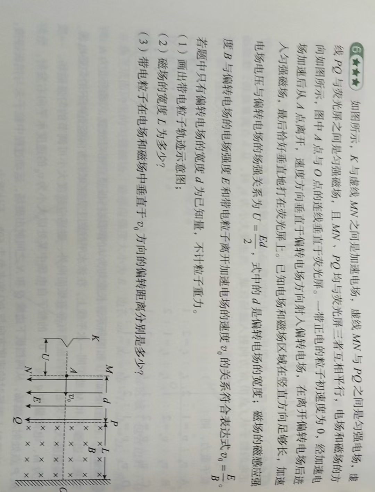

# FilaGlyph

FilaGlyph 是一个多智能体驱动的教学视频生成系统。输入题目图片后，系统会自动完成解题、分镜、动画代码生成、公式布局、配音和视频合成，最终产出可播放的讲解视频。

项目基于 Manim 与桌面 GUI 工作流，适合用于物理题讲解视频的自动化生产与迭代。

## 核心能力

- 题图输入到视频输出的一体化流水线
- 多角色智能体协作（Solver、Quantizer、Architect、Director、Animator、Coder）
- 运行时场景代码生成与校验（语法校验、公式布局校验）
- 本地 TTS 配音合成（CosyVoice）
- GUI 端任务管理、失败续跑与产物追踪

## 项目结构

主要目录说明：

- app_agent_desktop.py：桌面应用入口
- src/agents：智能体工作流与工具实现
- src/makevideo：视频拼接与渲染管线
- prompts：各角色系统提示词
- config：凭据与运行配置
- materials/voices：音色素材
- outputs/agent_runs：每次任务的运行日志与中间产物
- outputs/lesson.mp4：默认最终视频输出

## 环境要求

- Windows 10/11（当前项目主要在 Windows 下使用）
- Python 3.10
- FFmpeg（已加入系统 PATH）
- 能访问所选大模型服务（OpenAI、Gemini、DeepSeek、Qwen 等）

## 安装

在项目根目录执行：

```powershell
pip install "setuptools<81.0.0"
pip install openai-whisper==20231117 --no-build-isolation
pip install -r requirements.txt
```

## CosyVoice TTS
- 仅支持 CosyVoice。
- `--tts-backend local`：在 GPU/CPU 上运行本地 CosyVoice2-0.5B。
- 声音克隆直接接受 `wav` 格式，常见压缩格式（如 `m4a`）会在推理前自动转码为临时 wav 文件。

## 配置

编辑文件 config/agents_credentials.json，填写每个角色的 provider、api_key、model、base_url。

角色列表：

- solver
- quantizer
- architect
- director
- animator
- coder

示例（请替换为自己的实际配置）：

```json
{
  "roles": {
    "solver": {
      "provider": "gemini",
      "api_key": "YOUR_KEY",
      "model": "gemini-3.1-pro-preview",
      "base_url": ""
    },
    "quantizer": {
      "provider": "deepseek",
      "api_key": "YOUR_KEY",
      "model": "deepseek-reasoner",
      "base_url": "https://api.deepseek.com/v1"
    },
    "architect": {
      "provider": "gemini",
      "api_key": "YOUR_KEY",
      "model": "gemini-3.1-pro-preview",
      "base_url": ""
    },
    "director": {
      "provider": "gemini",
      "api_key": "YOUR_KEY",
      "model": "gemini-3.1-pro-preview",
      "base_url": ""
    },
    "animator": {
      "provider": "gemini",
      "api_key": "YOUR_KEY",
      "model": "gemini-3.1-pro-preview",
      "base_url": ""
    },
    "coder": {
      "provider": "deepseek",
      "api_key": "YOUR_KEY",
      "model": "deepseek-reasoner",
      "base_url": "https://api.deepseek.com/v1"
    }
  },
  "timeouts": {
    "default_s": 300
  }
}
```

## 启动桌面应用

在项目根目录执行：

```powershell
python app_agent_desktop.py
```

在应用侧边栏点击 `设置`，填写角色的 API Key（`solver` / `quantizer` / `architect` / `director` / `animator` / `coder`）。

建议：`quantizer` 使用 DeepSeek（如 `deepseek-reasoner`），负责结构化/数值化物理量；`solver` 负责题意理解与推导。

在应用侧边栏点击 `音频`，在音色素材栏添加你的音频，可以选择音频文件或直接录制你的声音。建议输入对应的语音原文，这能大幅提高复刻准确度。

在应用侧边栏点击 `工作台`，上传题目图片，选择音色，点击 `启动`。等待合成。

在右侧输出栏等待合成完毕后，点击播放视频，或打开文件夹获取视频文件。

## 栗子

1. 

题目图片：


桌面应用程序：

https://github.com/user-attachments/assets/a1ecc99f-5d85-471f-8d91-a881d7bc2cfc

output:

https://github.com/user-attachments/assets/0f13d677-9f93-48a4-9ff3-a3f6ca13bcc4


这个例子用的音频是没有设置语音原文的，所以调用跨语言复刻模式。虽然配音生动，但稳定性不够完美，不适用于严肃教学场景。

2. 

题目图片：


桌面应用程序:


output:

https://github.com/user-attachments/assets/ef86e560-0149-4841-bb68-14c26f396953

3.

这是最新的结果，修复了公式重叠的问题。

题目图片：



output:


https://github.com/user-attachments/assets/4ae98de2-4eb2-4389-b98a-95c13d5c25ac

