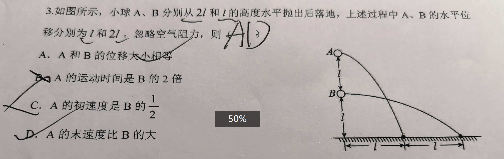
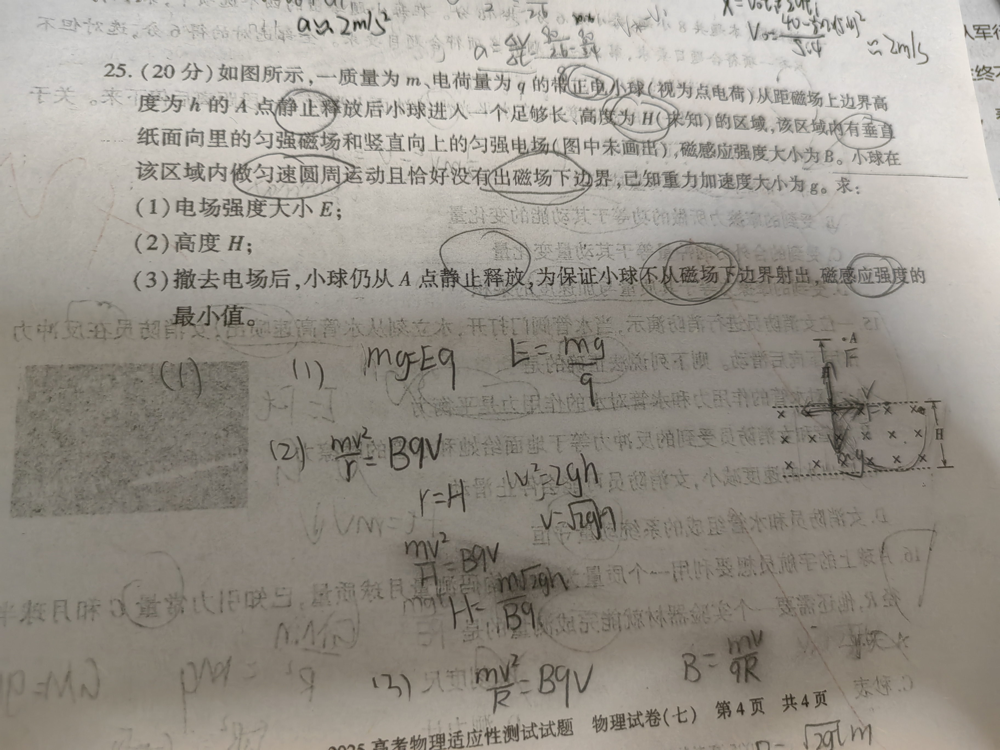
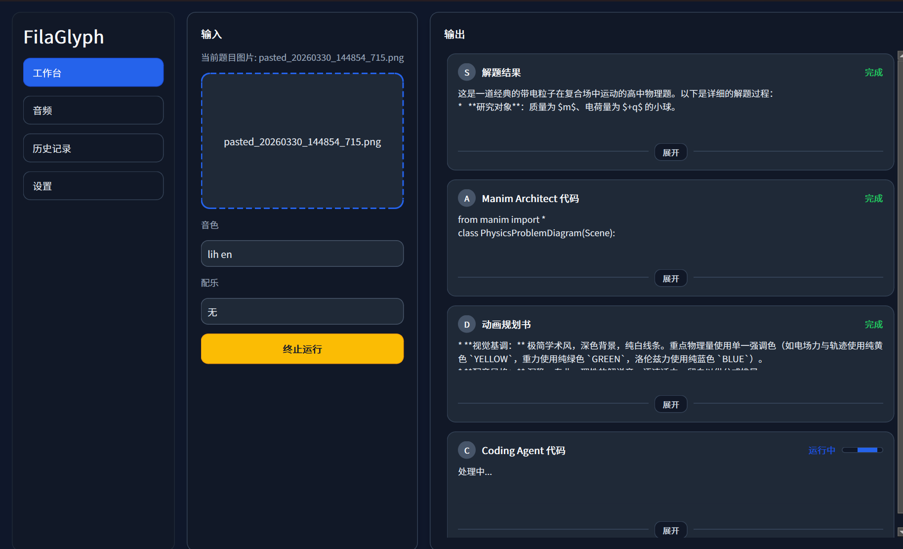

# FilaGlyph

FilaGlyph 是一个基于 Manim 的教学视频制作流水线项目。上传题目图片，获得3Blue1Brown风格的讲解视频。

## 安装

```powershell
pip install "setuptools<81.0.0"
pip install openai-whisper==20231117 --no-build-isolation
pip install -r requirements.txt
```

## CosyVoice TTS
- 仅支持 CosyVoice。
- `--tts-backend local`：在 GPU/CPU 上运行本地 CosyVoice2-0.5B。
- 声音克隆直接接受 `wav` 格式，常见压缩格式（如 `m4a`）会在推理前自动转码为临时 wav 文件。

## 配置

在 `config/agents_credentials.json` 中：

```json
{
  "roles": {
    "solver": {
      "provider": "",
      "api_key": "abc",
      "model": "gemini-3.1-pro-preview",
      "base_url": ""
    },
    "architect": {
      "provider": "",
      "api_key": "def",
      "model": "gemini-3.1-pro-preview",
      "base_url": ""
    },
    "director": {
      "provider": "",
      "api_key": "ghi",
      "model": "gemini-3.1-pro-preview",
      "base_url": ""
    },
    "coder": {
      "provider": "",
      "api_key": "opq",
      "model": "deepseek-reasoner",
      "base_url": "https://api.deepseek.com/v1"
    }
  },
  "timeouts": {
    "default_s": 300
  }
}

```

以上仅供参考。选择你喜欢的模型，填写你的API。

## 图形界面

启动应用程序。

```powershell
venv\Scripts\python.exe app_agent_desktop.py
```

在应用侧边栏点击 `设置`，填写四个角色的 API Key（`solver` / `architect` / `director` / `coder`）。前三个需要有识图能力的模型，如Gemini。

在应用侧边栏点击 `音频`，在音色素材栏添加你的音频，可以选择音频文件或直接录制你的声音。建议输入对应的语音原文，这能大幅提高复刻准确度。

在应用侧边栏点击 `工作台`，上传题目图片，选择音色，点击 `启动`。等待合成。

在右侧输出栏等待合成完毕后，点击播放视频，或打开文件夹获取视频文件。

## 栗子

1. 

题目图片：



桌面应用程序：

<video src="https://raw.githubusercontent.com/lihuss/FilaGlyph/main/examples/gui_show.mp4" width="100%" controls></video>

output:

<video src="https://raw.githubusercontent.com/lihuss/FilaGlyph/main/examples/pingpao_lesson.mp4" width="100%" controls></video>

这个例子用的音频是没有设置语音原文的，所以调用跨语言复刻模式。虽然配音生动，但稳定性不够完美，不适用于严肃教学场景。

2. 

题目图片：



桌面应用程序:



output:

<video src="https://raw.githubusercontent.com/lihuss/FilaGlyph/main/examples/magne_lesson.mp4" width="100%" controls></video>